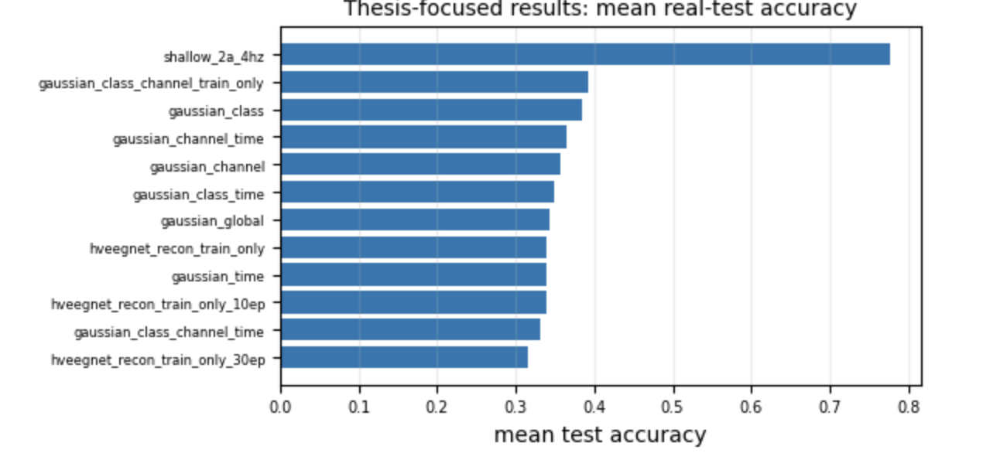

# Synthetic EEG Benchmark for Motor Imagery Classification

**MSc Artificial Intelligence thesis — Queen Mary University of London, 2026**

A reproducible benchmark for evaluating whether synthetic EEG can replace or augment participant-specific training data for motor-imagery classification under real validation and test conditions.



## Results

| Training data | Real test accuracy |
| --- | ---: |
| Real EEG | **69.24% ± 16.06** |
| H-VAE reconstruction | **68.06% ± 16.62** |
| Best Gaussian generator | **31.91% ± 5.04** |
| Conditional VAE | **25.73% ± 1.57** |

The main result was a clear distinction between **reconstruction** and **independent generation**. H-VAE reconstructions retained most of the discriminative information present in real trials, while independently generated synthetic EEG performed close to the four-class chance level.

At 50% Gaussian replacement, accuracy fell to **56.35%**. Adding Gaussian synthetic EEG equal to 50% of the real training-set size reached **62.12%**, still below the real-only baseline.

## Research question\n\nCan synthetic EEG replace participant-specific real EEG when model selection and final evaluation remain entirely real?\n\n## Contributions\n\n- Unified real-vs-synthetic evaluation protocol across 9 participants\n- Eight Gaussian synthetic-data controls\n- H-VAE reconstruction and conditional VAE generation\n- Class-specific and hierarchical conditional VAE variants\n- Replacement and augmentation ratio experiments\n- Fixed ShallowFBCSPNet downstream evaluation across repeated seeds\n- Method-level and participant-level final result summaries\n\n## Experimental design

The experiments use **BCI Competition IV Dataset 2a** across all 9 participants:

- 4 motor-imagery classes: left hand, right hand, feet and tongue
- 22 EEG channels sampled at 250 Hz
- 4-second trials represented as 22 × 1000 samples
- first recording session used for development
- second recording session held out for final testing
- generators fitted only on real training data
- validation and test data always real

For each participant, the development session is split once into 259 training and 29 validation trials. The evaluation session contains 288 held-out test trials.

## Methods

The same **ShallowFBCSPNet** downstream classifier is used across conditions so that the source of the training EEG is the primary experimental variable.

Synthetic conditions include:

- eight Gaussian controls with different class, channel and time conditioning
- H-VAE reconstruction using hvEEGNet
- conditional VAE prior generation
- exploratory class-specific and hierarchical conditional VAE variants
- synthetic replacement and augmentation ratio experiments

Classifier runs use three random seeds, with independent generator seeds used for synthetic generation experiments.

## Why this matters

The experiments show that producing EEG that preserves or resembles properties of the original signal is not sufficient evidence that the data are useful for downstream learning.

The reconstruction model preserved existing task-relevant information, but the independently generative approaches did not reproduce enough discriminative structure to replace real participant-specific EEG under this protocol.

## Repository structure

```text
eeg_pipeline/
  pipeline/       Core data, classifier, generator and evaluation code
  experiments/    Generation and downstream evaluation experiments
scripts/           Final experiment runner
results/           Final summary tables
assets/            Portfolio figures
docs/              Reproducibility notes
requirements/      Locked classifier and VAE environments
```

## Reproducibility

The original EEG recordings, generated arrays and model checkpoints are not distributed in this repository.

Environment details, external repository versions and modifications are documented in [`docs/reproducibility.md`](docs/reproducibility.md).

## Tech

Python · PyTorch · Braindecode · NumPy · EEG · Brain-computer interfaces · Variational autoencoders · Synthetic data · Experimental evaluation
